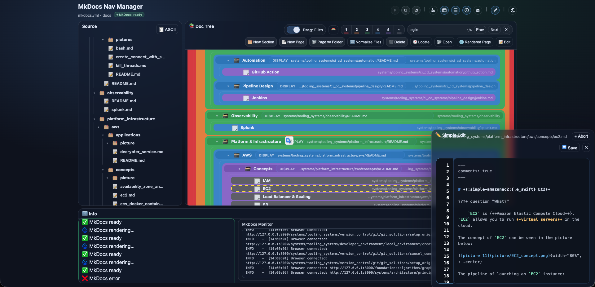
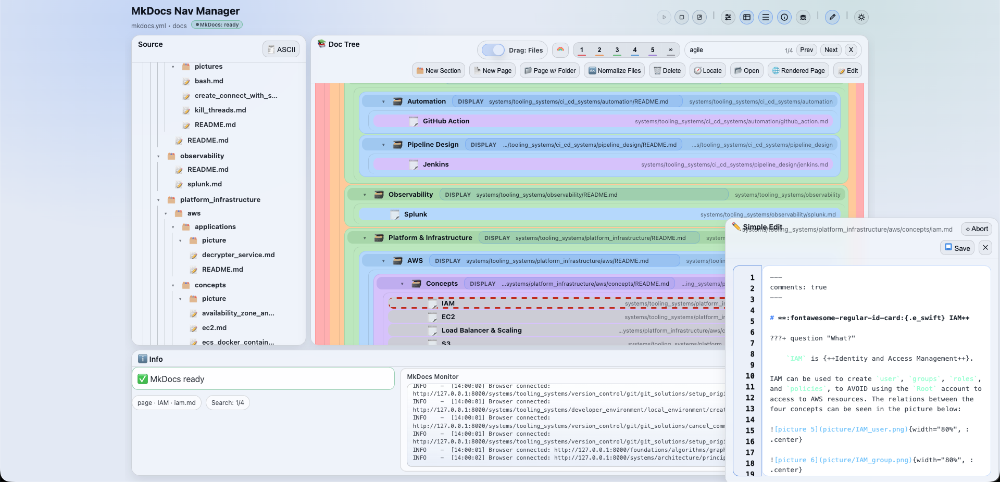

  

<h1 align="center">MkDocs Nav Manager</h1>

  <strong>Visual editor for MkDocs navigation and docs structure</strong>

> Drop `MkDocs_Nav_Manager/` into the root of your MkDocs project (next to `mkdocs.yml`) to edit `nav` using a Confluence-like page tree and keep `docs/` (or `doc/`) synced on disk.

## Major Capabilities

### Navigation + Docs Sync

- Confluence-like tree that maps directly to `mkdocs.yml` nav.
- Creates, moves, and deletes pages/sections while keeping the filesystem in sync.
- Keeps `docs/` (or `doc/`) aligned with the tree structure.

### Editing Experience

- Dockable layout with resizable split panels.
- Source explorer linked to the Doc Tree (including optional ASCII view).
- Inline rename for pages, sections, and filenames (no dialogs).
- Precision drag & drop with clear before/after/inside indicators.
- Optional rainbow level colors for quick hierarchy scanning.

### Safety + Reliability

- Safe deletes: prevents removing non-empty sections; page delete also removes its `.md` and sibling asset folder.
- Undo/Redo that tracks filesystem changes (last 5 steps stored in browser).
- Conflict safety: blocks sync if a target path already exists.

### Embedded MkDocs Serve

- Start/stop `mkdocs serve --livereload` from the toolbar.
- Live status + log monitor inside the Info panel.
- One-click open of the rendered site in the browser.

### Simple Editor

- Built-in “Simple Edit” markdown editor for the selected page.
- Line numbers, lightweight markdown highlighting, and +/~/- change counters.
- Save/Abort controls and `Ctrl/Cmd+S` quick save.

### Visuals

- Day/Night theme toggle and optional Debug panel.

## Quick Start

`pip install -r MkDocs_Nav_Manager/requirements.txt`

`python MkDocs_Nav_Manager/app.py`

Open: `http://127.0.0.1:5000`

## Defaults

- `mkdocs.yml`: project root `mkdocs.yml` (override with `MKDOCS_PATH`)
- `docs_root`: uses `docs_dir` when set, otherwise auto-detects `docs/` or `doc/` (override with `DOCS_ROOT`)
- State file: `MkDocs_Nav_Manager/.page_tree_state.json` (override with `STATE_PATH`)
- Backups: creates `MkDocs_Nav_Manager/backups/mkdocs/` (keeps latest 5), disable with `MKDOCS_BACKUP=0`

## Troubleshooting

- Port 5000 in use: `lsof -nP -iTCP:5000 -sTCP:LISTEN` or start on another port.
